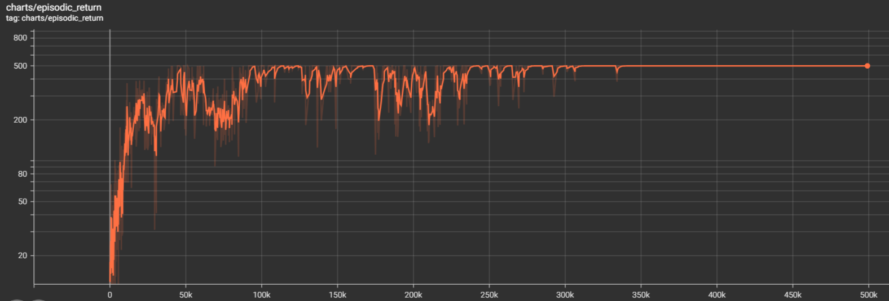
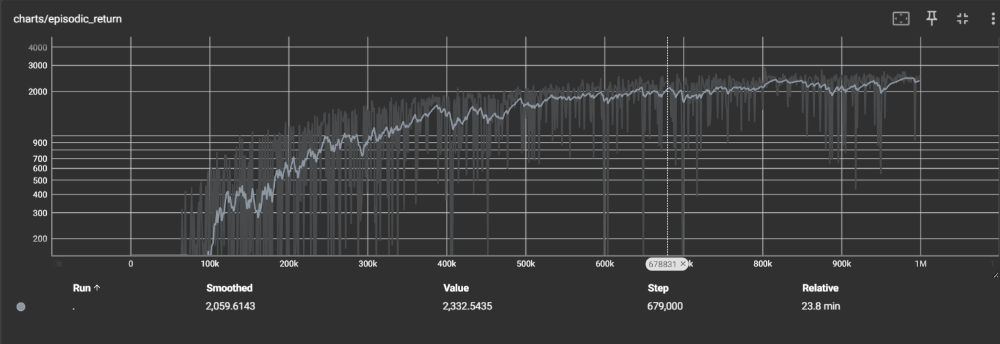

# Simple Proximal Policy Optimization (PPO) Implementation

This repository contains a clean, modular implementation of the Proximal Policy Optimization (PPO) algorithm in PyTorch. PPO is a popular reinforcement learning algorithm known for its stability and performance across a wide range of tasks.

This implementation has been written with a strong focus on readability and educational value, as well as performance. The code is thoroughly commented and structured to be easily understood, making it an excellent resource for those learning about PPO or looking to use this implementation a reference architecture for their own projects.

## Project Structure
- `agent.py`: Contains examples of neural network architectures for the policy and value function, along with the interface (ABC) for the PPO implementation
- `ppo.py`: Contains the core PPO implementation
- `main.py`: Example script demonstrating how to use the PPO implementation

The `examples` folder contains examples of using `main.py` to train an agent on the [CartPole-v1](https://gymnasium.farama.org/environments/classic_control/cart_pole/) and [HalfCheetah-v4](https://gymnasium.farama.org/environments/mujoco/half_cheetah/#half-cheetah) gymnasium environments.

## Features

- Support for both discrete and continuous action spaces
- Parallel environment execution for improved training efficiency
- Generalized Advantage Estimation (GAE)
- Clipped surrogate objective for stable policy updates
- Value function clipping option
- Entropy bonus for exploration
- Learning rate annealing
- Advantage normalization
- Gradient clipping
- Early stopping based on KL divergence (optional)


## Results

### CartPole-v1

The average episodic return using `examples/run_cartpole_with_video.py` is shown below:



### HalfCheetah-v4

The average episodic return using `examples/run_half_cheetah.py` is shown below:



*Note* These results seem largely consistent with [Clean-RL's implementation](https://docs.cleanrl.dev/rl-algorithms/ppo/). However, little to no hyperparameter tuning was conducted.


## Usage

The PPO implementation is contained in `ppo.py`. To use it, you can refer to the example in `main.py`.

To run the example script:

```python
python main.py
```

This will train an agent on the CartPole-v1 environment using default parameters.

To train on a continuous action space environment (e.g., HalfCheetah-v4), you can modify the parameters in `main.py` or run it with command-line arguments:

```python
python main.py --env_id HalfCheetah-v4 --env_is_discrete False --total_timesteps 1000000 --learning_rate 3e-4 --num_envs 1 --num_rollout_steps 2048 --num_minibatches 32 --update_epochs 10 --entropy_loss_coefficient 0.0 --capture_video True
```

## Customization

You can customize various hyperparameters and settings by modifying the arguments in the `main` function in `main.py`. Key parameters include:

- `env_id`: The Gymnasium environment ID
- `env_is_discrete`: Whether the environment has a discrete action space
- `num_envs`: Number of parallel environments
- `total_timesteps`: Total number of environment steps for training
- `learning_rate`: Learning rate for the optimizer
- `gamma`: Discount factor
- `gae_lambda`: Lambda parameter for GAE
- `surrogate_clip_threshold`: Clipping parameter for the surrogate objective
- `entropy_loss_coefficient`: Coefficient for the entropy bonus
- `value_function_loss_coefficient`: Coefficient for the value function loss


## License

This project is licensed under the MIT License - see the [LICENSE](LICENSE) file for details.

## Acknowledgements

This implementation is inspired by various PPO implementations and research papers, including:

- [Proximal Policy Optimization Algorithms](https://arxiv.org/abs/1707.06347) by Schulman et al.
- [The 37 Implementation Details of Proximal Policy Optimization](https://iclr-blog-track.github.io/2022/03/25/ppo-implementation-details/)
- [OpenAI's Spinning Up](https://spinningup.openai.com/en/latest/algorithms/ppo.html)
- [CleanRL](https://github.com/vwxyzjn/cleanrl)
